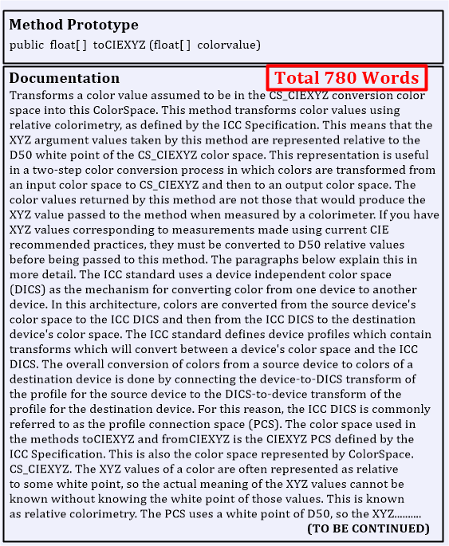

# Examples

This page just provides some examples found on API documentation bloat.

<figure><figcaption>
Example 1 - A Bloated API method, being described. (<a href="https://www.researchgate.net/figure/Example-of-Bloated-Smell_fig4_349392051">https://www.researchgate.net/figure/Example-of-Bloated-Smell_fig4_349392051</a>)
</figcaption></figure>
